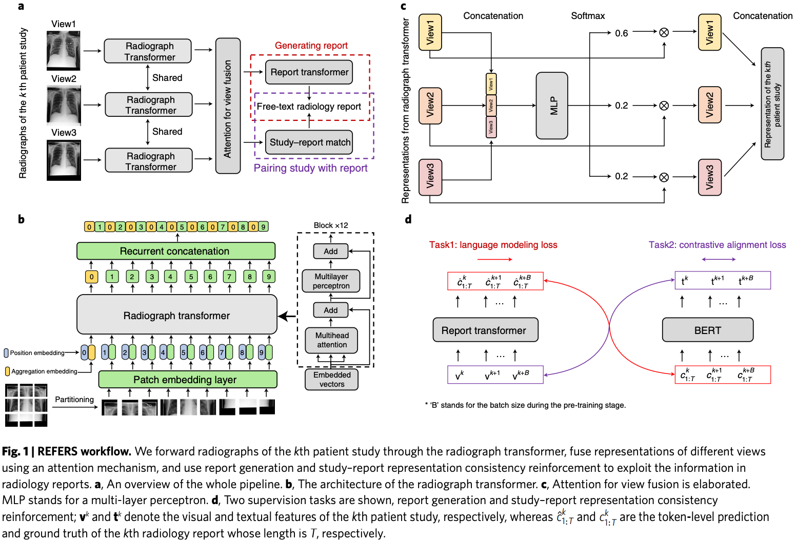

# Awesome Illustrations for Computer Vision

计算机视觉论文中的图，表，算法表等。

不分好坏，各有优缺。多看，多品，致力于提升美感。

图源在每张图的 Markdown caption 里标明。

关于色彩搭配：

- [[Adobe Color]](https://color.adobe.com/zh/explore/)
- [[色卡 App]](https://apps.apple.com/cn/app/id1207354572)

## 0. Content

- [Awesome Illustrations for Computer Vision](#awesome-illustrations-for-computer-vision)
  - [0. Content](#0-content)
  - [1. Figure One](#1-figure-one)
  - [2. Methodology](#2-methodology)
  - [3. Experiments](#3-experiments)

## 1. Figure One

- 换一个视角，给人以新鲜感。
- 活泼的色彩。

- 从方法中抽象出了最本质的创新点。

- 在 3D 视觉任务中，人物也是 3D 的；作者就把所有图像也作 3D 布置。

## 2. Methodology

- 对称美。
- 把重复的模块堆叠起来，只展开其中一个。
- 用不同的色块区分不同的功能模块。

- 简单，好看，色彩搭配合理。

- 图文并茂讲公式。

- 双 Flow 支路画法。
- 有点空。

- 作为 Work flow，每个部分都会比较简单；但作者通过子图把各部分组合在一起。

- 大图和小图都比较简单；但作者通过子图把两张图组合在一起。

- 四宫格组图。

- 如果方法的中间结果比较好看，可以用这种方式展示 Pipeline。网络结构不太适用。

- 纯文字画法，细节在之后的小图中继续展示。
- 对称美。
- 配色不过于鲜艳。

- 快速表达出核心点：多尺度卷积，稠密链接，PQF 参与。
- 把不重要的组件用简单的圆圈或方块表示即可。

- 用圆圈表示不重要的卷积操作。
- 漂亮的曲线。
- 这种极简框图适用于创新程度较高的开坑工作。

- 算法表。理解难度大于图和表，不建议常用。
- 要说清楚变量、初始条件等。

- 多层级。

- 可视化画法表示简单的注意力。

## 3. Experiments

- t-SNE 特征降维可视化很好看，可以上色，还可以看聚类效果。

- t-SNE 特征降维可视化很好看，可以上色，还可以看聚类效果。

- 渐变色有两种好处：把左右两侧的指标分离开；表示数值相对大小。
- 颜色单一不是坏事。

- 率失真曲线：压缩领域常用，很好看。

- 信息量大，间距合理。
- 对一种配置展开所有视频的数据，对其他类似配置只展示均值。
- 适当采用科学计数法。

- 折线连接、同一配色同一类方法。
- 点缀的小星星，加引用增强说服力。

- 表达了三个维度的信息。

- 表达了三个维度的信息。
- 同一个系列的网络用折线连接，用同一配色。
- 加了网格。

- 溶解试验常用的递进溶解表格。

- 对比算法、库都很多，说服力强。
- 这种大表格适用于期刊，不适用于会议。

- 对数坐标轴。
- 渐变色。

- 标准的主观图画法。

- 另一种主观图画法。比较考验排版。
