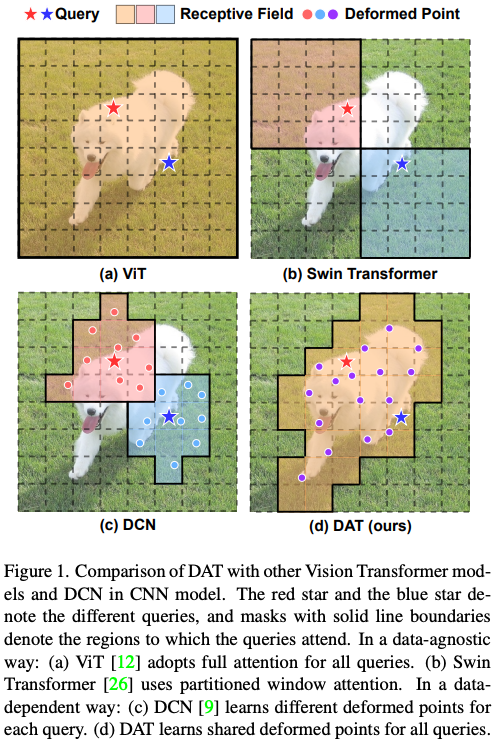
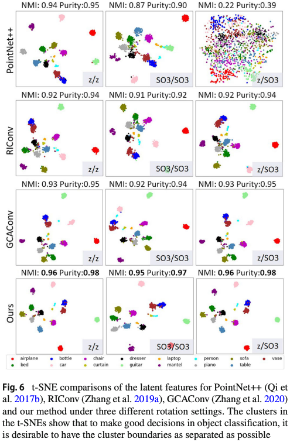

# Awesome Illustrations for Computer Vision

Figures, tables and algorithms of scientific papers in computer vision.

[[Other illustrations]](https://github.com/ryanxingql/awesome-computer-vision-illustration/blob/main/others.md)

## 0. Content

- [Awesome Illustrations for Computer Vision](#awesome-illustrations-for-computer-vision)
  - [0. Content](#0-content)
  - [1. Figure One](#1-figure-one)
  - [2. Experiments](#2-experiments)

## 1. Figure One

- 从方法中抽象出了最本质的创新点。符合乔布斯传中对极简主义的定义。

## 2. Experiments

- t-SNE 特征降维可视化很好看，可以上色，还可以看聚类效果。
