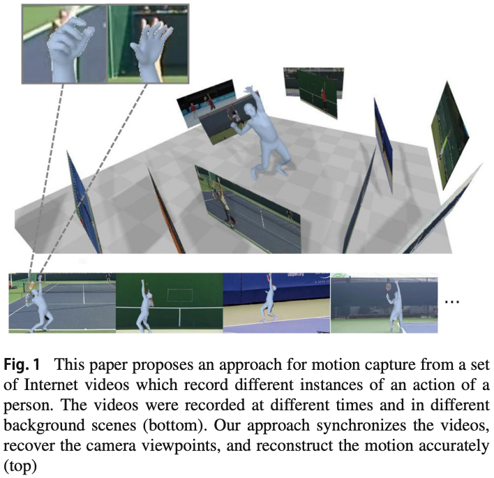
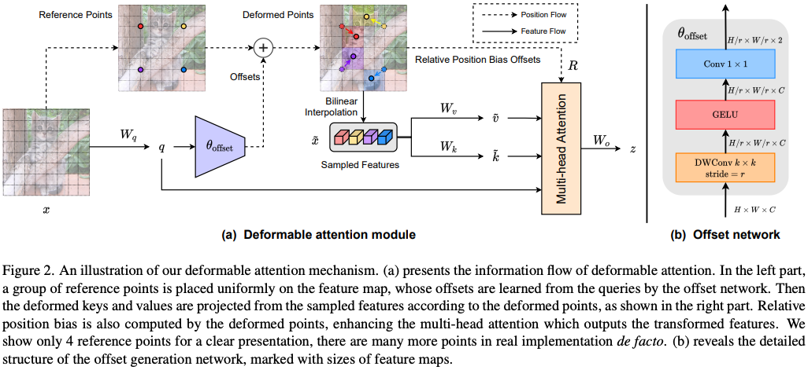
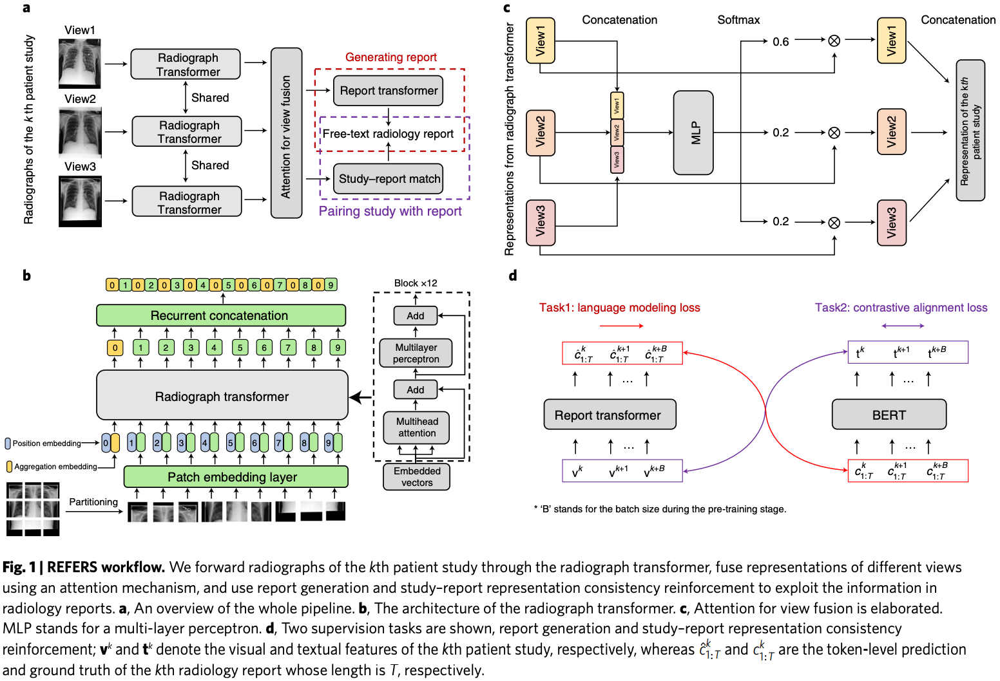
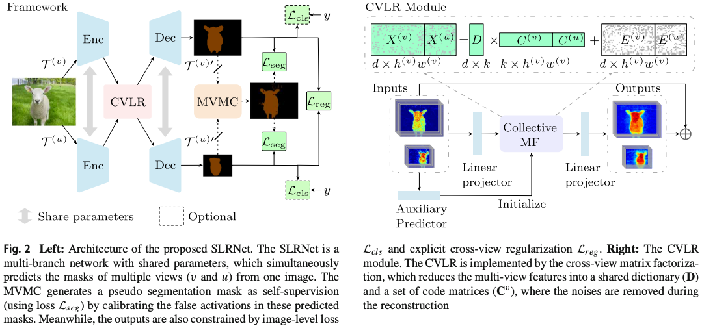
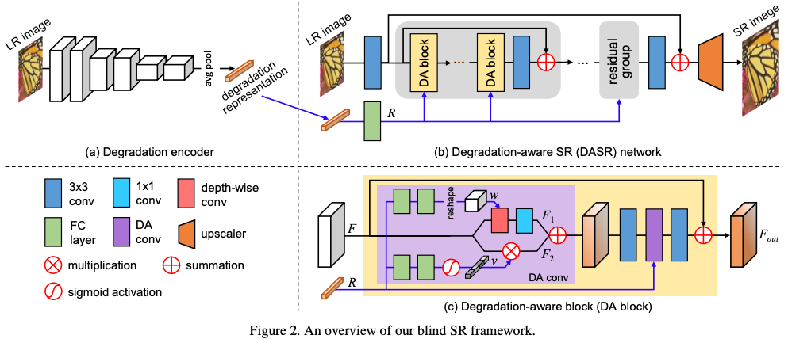
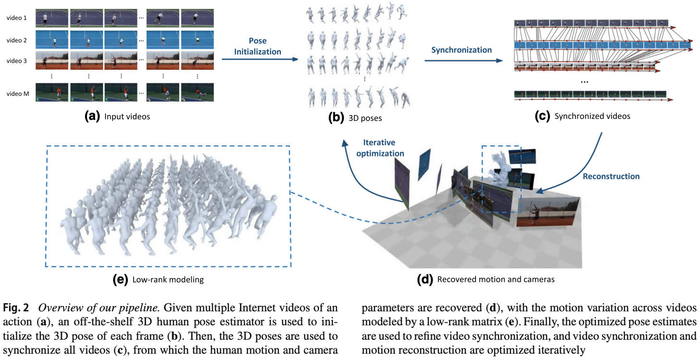

# Other Illustrations

## 0. Content

- [Other Illustrations](#other-illustrations)
  - [0. Content](#0-content)
  - [1. Figure One](#1-figure-one)
  - [2. Methodology](#2-methodology)

## 1. Figure One

- 在 3D 视觉任务中，人物也是 3D 的；作者就把所有图像也作 3D 布置。

## 2. Methodology

- 双 Flow 支路画法。
- 有点空。

- 作为 Work flow，每个部分都会比较简单；但作者通过子图把各部分组合在一起。

- t-SNE 特征降维可视化很好看，可以上色，还可以看聚类效果。

- 大图和小图都比较简单；但作者通过子图把两张图组合在一起。

- 如果方法的中间结果比较好看，可以用这种方式展示 Pipeline。网络结构不太适用。
